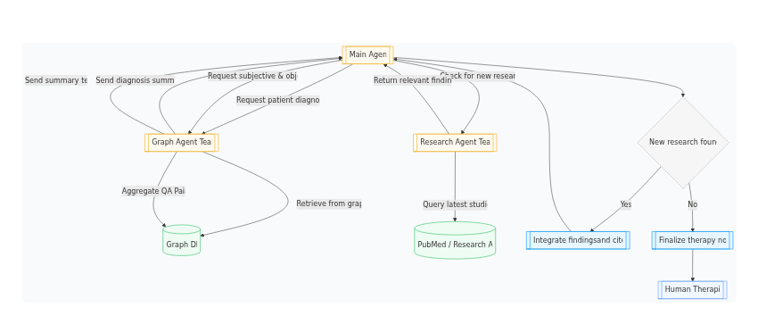
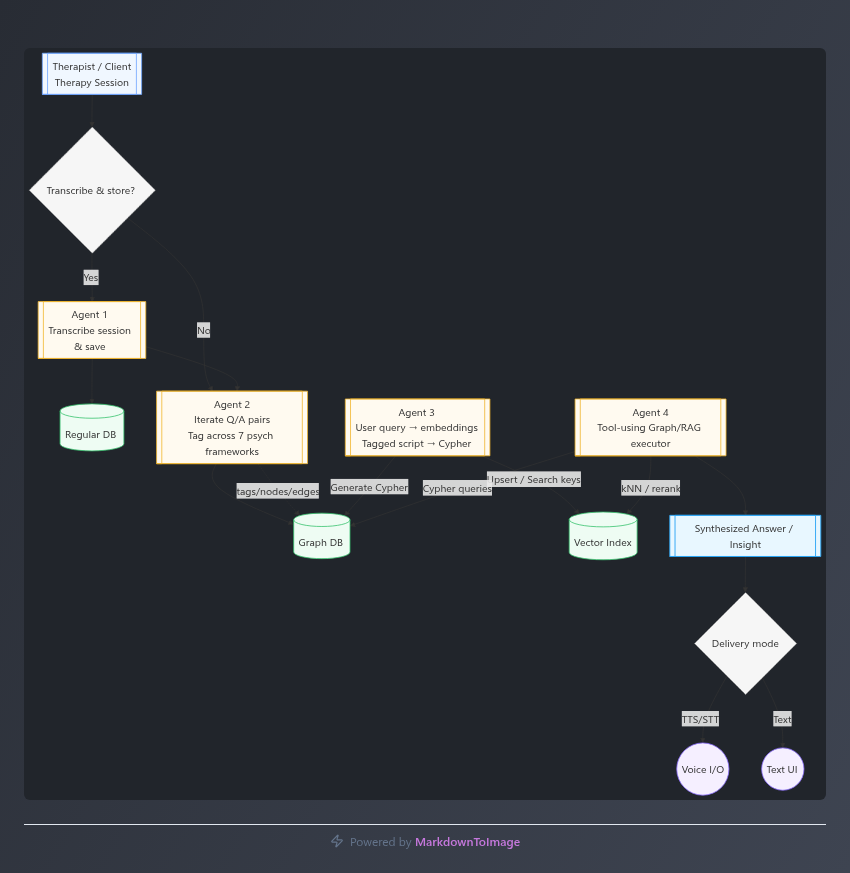

  <br><br>
<p align="center">
  
</p>
  <br><br>
<p align="center">
  
</p>

### Overview
Recent studies highlight the measurable benefits of artificial intelligence in clinical assessment. A University of Virginia (2024) study compared diagnostic accuracy between physicians and AI systems, finding:
Human physicians: ~74–76% accuracy
Physicians using AI assistance: ~76%
AI systems alone: ~90%
More recent work by the University of California, San Diego (2025) reinforced this, demonstrating that AI-assisted clinicians achieved greater diagnostic consistency and reduced bias, particularly across racially and socioeconomically diverse patient groups.
Similar studies have taken place in Europe, most notably when a team from UniBE (Bern), Institute of Psychology, and UNIGE's (Geneva) Swiss Center for Affective Sciences (CISA) subjected six LLMs to emotional intelligence tests commonly used in both research and corporate settings. 
In the end, the LLMs achieved 82% correct answers versus 56% for humans. 
In a second stage, the scientists asked ChatGPT-4 to create new emotional intelligence tests, with new scenarios, then taken by over 400 participants. They proved to be as reliable, clear and realistic as the original tests, which had taken years to develop
These findings support the rationale for implementing AI-driven analytic workflows in psychotherapy and clinical documentation enhancing consistency, reducing subjective bias, and enabling more objective, quantifiable assessments.
At present there are numerous US-based AI start-ups building solutions to relinquish clinicians of their administrative burdens, an endeavour promising to optimize commercial outcomes and efficiency.

### Workflow 1: Enhanced Analysis
The first workflow transcribes or ingests therapy session data (audio or text) and decomposes it into structured QA pairs. Each pair is processed through multiple psychological frameworks and embedded into a graph-based cognitive-emotional architecture.
This tagging approach expands traditional qualitative analysis by mapping why something was said (cognitive bias), when it matters (developmental anchor), how it felt (valence/arousal), and who it reflects (traits, schemas, defenses, attachments). The resulting knowledge graph allows clinicians or AI systems to perform semantic and quantitative searches across sessions.

Figure 1: 

  <br><br>
<p align="center">
  
</p>

### Example Analysis (Pre-Graph Format)

---

Question: Can you describe in your own words how you typically experience emotions?
Response: Rarely, if I experience emotions directly about myself, they are understated to say the least. Rather it feels like I feel emotions through others, reflecting their feelings, or my perception of their feelings, opposed to having feelings about myself. If I’m with someone who’s happy, I feel happy. If I’m with someone sad, I feel sad.
Subjective Analysis:
 The client reports limited self-directed affect, with emotions experienced vicariously through others. This pattern suggests restricted interoceptive awareness and externalized affective referencing.
Objective Metrics:
Sentence count: 3
Mean sentence length: 18.7 words
First-person negative self-appraisals: 0
Topic reactivity: moderate (shift from abstract to interpersonal focus)


Instrument Outputs (Russell Model):
Empathy: valence 0.0, arousal 0.2, confidence 0.8
Vicarious happiness: valence 0.5, arousal 0.3, confidence 0.7
Vicarious sadness: valence −0.5, arousal 0.3, confidence 0.7
Emotional inhibition: valence −0.2, arousal 0.1, confidence 0.6


Psychometric Mapping:
Cognitive distortions: none (conf. 0.7)
Erikson stage: intimacy vs isolation (conf. 0.6)
Attachment: dismissive‑avoidant (conf. 0.7)
Schema: emotional inhibition (conf. 0.7)
Big Five profile (O 0.6 / C 0.5 / E 0.4 / A 0.7 / N 0.3) (conf. 0.7)


Formulation:
The client exhibits vicarious affect and inhibited self-emotion, consistent with avoidant attachment and emotional inhibition schema. Therapeutic focus should include emotional differentiation and self-affect recognition.
Interventions:
Psychoeducation on self-emotion awareness
Mindfulness/body-scan exercises to increase interoceptive sensitivity
Emotion journaling for personal affect tracking
Attachment-based reflection exercises

---

Figure 2: Workflow Diagram 1

  <br><br>
<p align="center">
  
</p>

### Workflow 2: Automated Documentation
A secondary multi-agent workflow automates the generation of Therapy Progress Notes, synthesizing data from Workflow 1. Multiple agents collaborate via a CLI-based orchestration layer, verifying uncertain information through trusted clinical databases (e.g., PubMed).

This process ensures structured, evidence-supported documentation, improving clinical efficiency and consistency.

Workflow 3: Interactive Interface
The final workflow integrates a conversational chat interface, enabling real-time interaction with graph-derived insights. The interface dynamically generates visualizations and supports both text and voice input, allowing therapists or researchers to explore psychological constructs interactively.


## Usage Instructions

> I have set this up to run with Gemini for ease of use, however it was developed and tested primarily with local models.

1. Download all project files. Rename the data_pub directory to just 'data', and rename the 'therapy_fictional.csv' to 'therapy_working.csv' (see also 'creating your own therapy script'). 
2. Create a venv `uv venv` and activate it. `source .venv/bin/activate`  
3. Install from requirements.txt: `uv pip install -r requirements.txt`
4. Here are the services you need to start each time:

```
cd /home/david-barnes/Documents/persona-forge-langgraph-master
./start_services.sh
```
5. The first langgraph workflow uses 'framework_analysis.py' to tag the script. Upload a file with this format (therapy_fictional.csv is made for you if you want to test):

```
Therapist,Client,message_id
"Question","Answer",001
"Question","Answer",002
```
6. The second langgraph workflow uses 'create_kg' to create the knowledge graph. 

Click on 'create graph' to begin the Cypher workflow. Paste the output file into neo4j in one go (i'll add an automation for this shortly).

All the embeddings for hybrid-graph-rag are created for you.


### Creating your own therapy script

LLM's have clearly been trained on lots of therapy scripts, since they are great at it. 

You can either generate your own session with an LLM (put it in the data file in the afforementioned format), and you can then use 'fixes/anonomize_therapy_csv.py' to change the story and modify the themes that occur.

You can also just ask an LLM to generate these files with your chosen topics and context. The app will analyse any amount of text, The langgraph workflow are specifically designed for long context answers from a text-based therapy script, whilst the sentiment analysis dashboard is designed for video transcript scripts (use the 'Carl and Gloria' cleaned CSV in the data file)

### For local Models Only
Also download all files in this repo (into project_dir: https://huggingface.co/deepdml/faster-whisper-large-v3-turbo-ct2/tree/main). 

Also download 'https://huggingface.co/rhasspy/piper-voices/tree/main/en/en_GB/alba/medium'. I use ubuntu and have that in my home dir, but you can change to your favoured TTS (in SentimentSuite.py).

Install piper on your system if not already.

## Required Environment variables

OPENAI_API_KEY="sk-proj-"
LANGSMITH_API_KEY="lsv2_"
LANGSMITH_TRACING_V2=true
ANTHROPIC_API_KEY=""
LANGSMITH_PROJECT="langchain-academy"
TAVILY_API_KEY="tvly-dev-"
USE_HOST_OLLAMA=true
OLLAMA_HOST="http://localhost:11434"
OLLAMA_EMBED_MODEL="nomic-embed-text:latest"

# Neo4j Configuration
NEO4J_URI="bolt://localhost:7687"
NEO4J_USER="neo4j"
NEO4JP="your_password"

HUGGINGFACE_TOKEN="hf_p"

# Cypher Generation LLM Configuration
# Set to "anthropic" to use Claude API, or "ollama" for local generation
CYPHER_LLM_PROVIDER="gemini"
CYPHER_OLLAMA_MODEL="gpt-oss:20b"
CYPHER_ANTHROPIC_MODEL="claude-3-5-sonnet-20241022"
CYPHER_GEMINI_MODEL="gemini-2.0-flash-exp"
# Add your Anthropic API key here when using Claude
ANTHROPIC_API_KEY="sk-ant-api03-ile"
GEMINI_API_KEY="AIza"

E2B_API_KEY="e2b_"
E2B_ACCESS_TOKEN="e2b"
E2B_TEAM_ID="70e8"
USE_E2B=true
copilotKit_publicApiKey="ck_pub_"
CopilotKit_publicLicenseKey="ck_pub_

OPENAI_API_KEY=lm-studio
OPENAI_BASE_URL=http://127.0.0.1:1234/v1

**Running the Deep Agent workflow:**

This is a little more complex, since I use multiple PC's hosting local agents. The easiest way to change this is to ask your VS Code AI (Claude or whatever, but it needs terminal control) to change all the lm-studio model instances to your chosen online model.

You can also editrun_deep_agent_e2b.py and 'src/graphs/deep_agent.py'. For example you would want to switch instances of:

`from langchain_openai import ChatOpenAI`

and

```
# Local models (main PC) - LM Studio configuration
alt_model = ChatOpenAI(
    model=LLMConfigPeon.model_name,  # aka 'alt'
    temperature=LLMConfigPeon.temperature,
    max_tokens=LLMConfigPeon.max_tokens,
    base_url="http://localhost:1234/v1",  # LM Studio's OpenAI-compatible endpoint
    api_key="lm-studio",  # LM Studio doesn't require a real key
)
```

to the notation for langgraph gemini:

```
import google.generativeai as genai


def get_gemini_model():
    """Initialize Gemini model using direct Google API."""
    api_key = os.getenv("GOOGLE_API_KEY")
    if not api_key:
        raise ValueError("GOOGLE_API_KEY not found in environment variables")

    genai.configure(api_key=api_key)

    return genai.GenerativeModel(
        model_name="gemini-2.0-flash-exp",
        generation_config={
            "temperature": 0.7,
            "max_output_tokens": 2048,
        }
    )

```

then run 'run_deep_agent_e2b.py'. Whilst it has a full front-end to look like Claude code, I have this set up so it pastes the prompt in to save you needing to do that each time.

**Important!**: You need to match my e2b versions or use earlier, since the later versions borked the API method.

