# Intro

# The Persona-Forge
- The Persona-Forge is a multi-agent Psychological Analysis tool, with a built in transcription workflow to transcribe 'Clinician/Client' therapy sessions.
- Optionally, a text-based therapy script can be used, as it was for my testing purposes.
- A wider project is being built to house automation workflows to expand upon this, and for now the details of that are included here.
The Persona-Forge has been a project of mine for close to two years, 'evolving' as I have 'pivoted' towards new tech and ideas.

It began as a simple idea to map personalities of anything from video games, to my own persona, using 'Knowledge Graphs' to map out 'Personality Constructs', or 'Persona'. Mapping include 'speaking tone' & 'vocabulary', profiling frameworks (e.g. 'Myers Briggs', history (e.g. key events in a persons life, and the emotions they trigger) and even metaphor or common phrase types that the character uses.
The use of AI in conjunction with 'the mind' is an exciting field which goes [much further](https://www.youtube.com/watch?v=WpwUZds7GEk) than my simple tool.

My lifelong passion for Psychology, the pace of AI, and my preference for 'altruistic projects' caused me to pivot to a more specific goal.

- My work on 'the perfect' Psychology model continues. However, Training a model doesn't make a good github repo, as it would be thousands of page of collected psychology data.

  <h2 align='center'>
  My Brain mapped out into Graph Form
  </h2>
  <br><br>
<p align="center">
  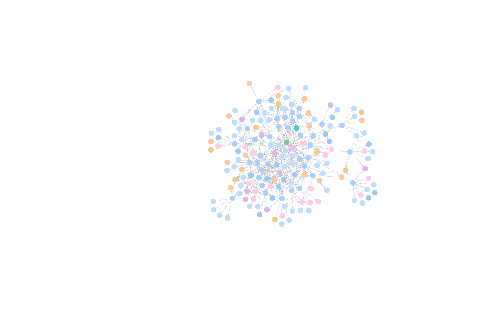
</p>

  <h2 align='center'>
  The main app page
  </h2>
  <br><br>
<p align="center">
  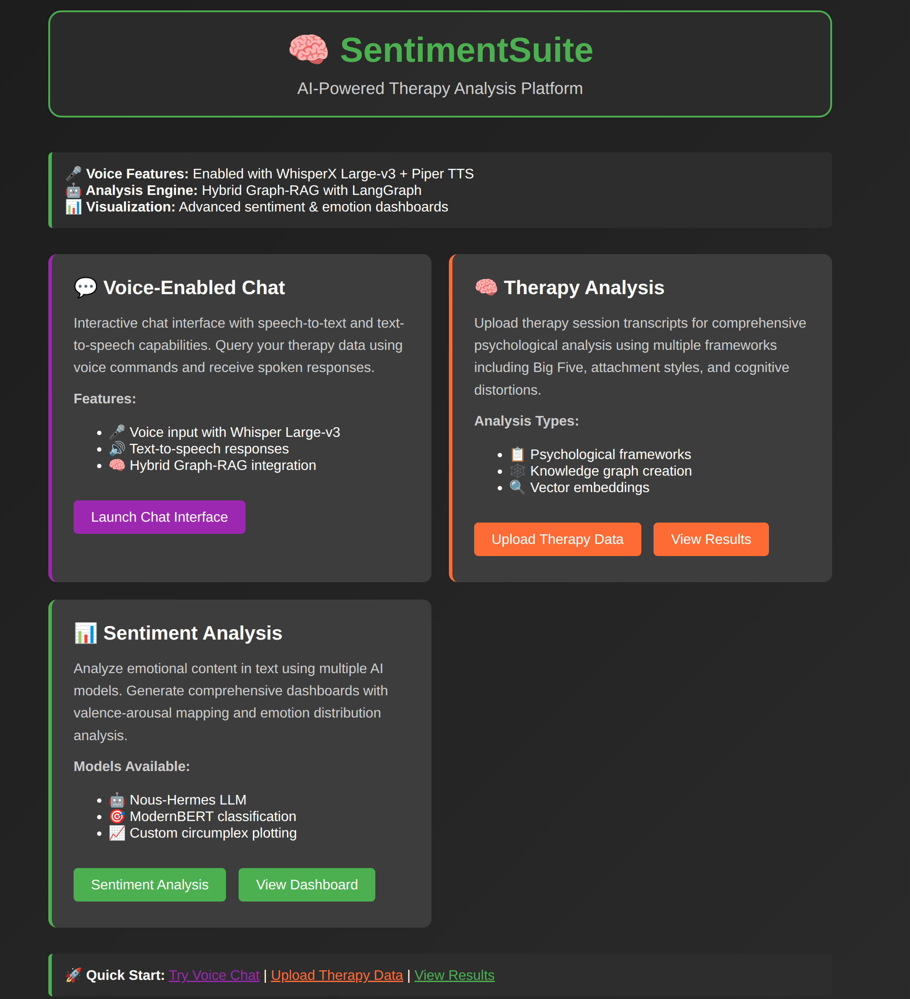
</p>

  <h2 align='center'>
  Querying of the analysis via a Chatbot & Hybrid-Graph-RAG (Voice to follow)
  </h2>
  <br><br>
<p align="center">
  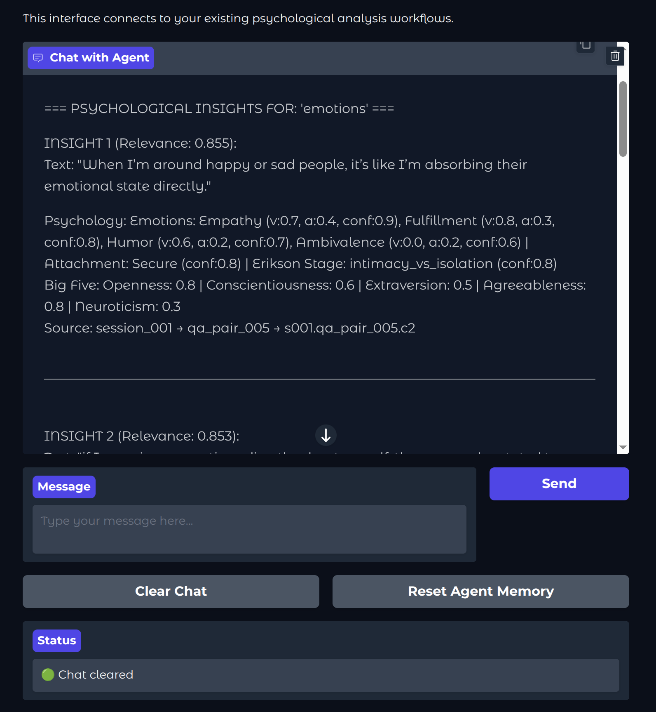
</p>

  <h2 align='center'>
  Recieving an overall summary of the clients personality (needs tuning)
  </h2>
  <br><br>
<p align="center">
  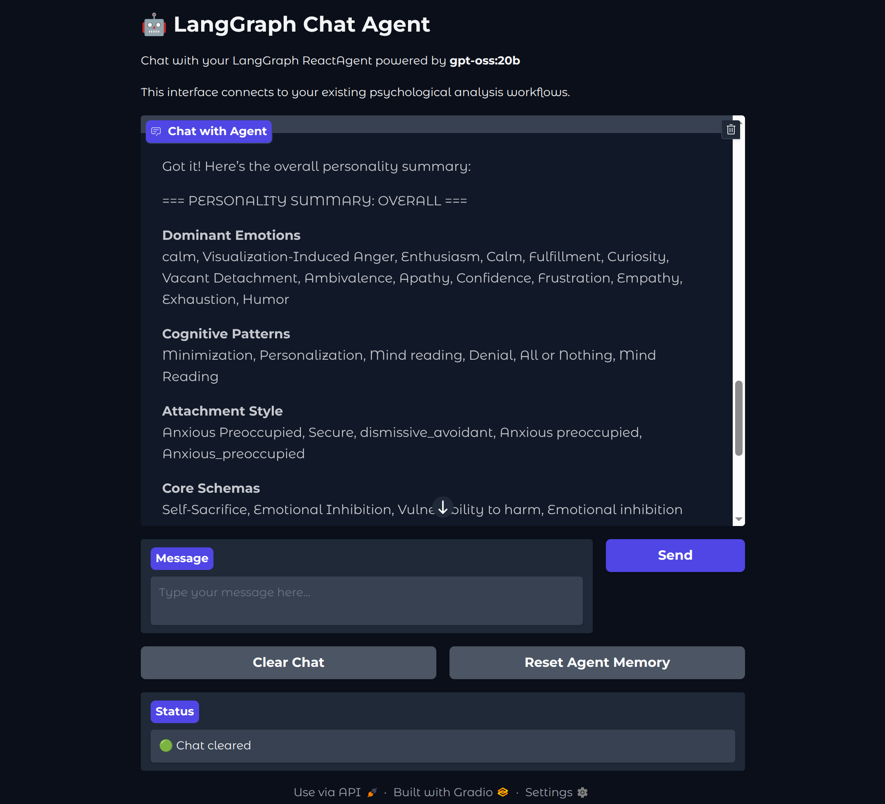
</p>


**For Clinicians / Non-Techies**:
- I present the core 'Psychology principles' involved in this README, sparing the technical jargon for its respective README.
- The dashboard concept was developed from a [project](https://github.com/David-Barnes-Data-Imaginations/SentimentSuite) that was intended to be a 'light demo' for a friend, using 'Russells Cicumplex' and 'utterances' to evaluate therapy session transcripts (Carl & Gloria etc.)
---
**For 'Techies' or those learning to build 'Advanced Agentic Systems'**: 
- The Technical README is [here]
---
The Persona-Forge is designed to help therapists and mental health hospitals modernize and care for patients. 
I'm in the concept stage for various other use cases, including an adaptation for criminal profiling and pattern matching, both 'online' and in the 'real-world'.

# Use Cases:

## 1. Hospital and/or Therapist/Clinician Support - 'Vision of the Future'
There are (currently) four AI agents involved, alongside various UI/Interface tools and many hours of research:

## Elements:
- To modernize Psychology, by providing the superhuman pattern matching and profiling abilities of AI, for Therapists and Hospitals. 
- This enhances insights for better work, _benefits_ the care for patients, and help therapists learn from their own techniques. 
- It cannot be stressed enough that this does not aim to 'replace' human therapists, clinicians or their current methods. 
- 'It's 'AI - Human augmentation via fusion'. _How_ this actually functions on a 'practical' / 'daily' level is still under intense scrutiny. The reason is the same reason that I love to build AI, I do _extensive_ testing (makes up about 70% of the work), and I'm being so blown away with idea's and possibilities I hadn't percieved, simultaneaously pivoting away from others that I thought _might_ work. 
- Modernizing patient interactions to streamlined automation processes that remove pen & paper based tools, again freeing up staff resources to care for patients more effectively.

## AI Models:

### Local (stressed for importance of privacy):
- GPT-oss:20b/120b locally hosted 'privacy-first' workflow automation

### Non-Local - Psychological Profiling:
- GPT 5 - Can be implemented optionally for advanced analysis, highlighting caution or concerns about the patient. 
- Sends back to local-agent to record and store.
  
## Interface & Process:
- The therapist dashboard includes results along with AI inference for retrieval of information and can be used via the web, with Knowledge Graph functionality coming from Neo4J.
  <h2 align='center'>
  My Brain mapped out in the Neo4J interface
  </h2>
  <br><br>
<p align="center">
  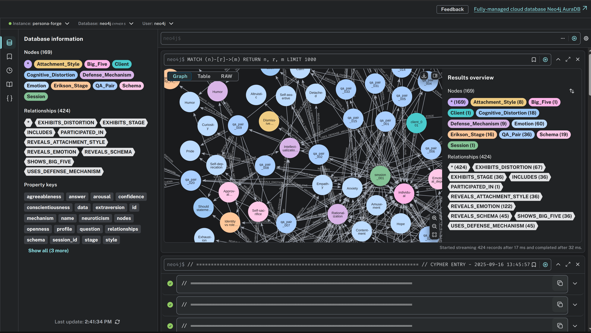
</p>

- The patient dashboard includes a 'Patient-Support' interface, with 'patient-care' central to the objectives.
- *Note*: If you've not heard of knowledge graphs, they are vector based (as are LLM's and RAG's) graphs which are incredibly fast for data retrieval (Google uses it for its search). 
- Most note-taking tools use them to connect your notes, but my 'go-to' LogSeq gives you a tab to view your notes and their relations. 
- See 'Psychology Framework Section'

  <h2 align='center'>
  The basic App front-page
  </h2>
  <br><br>
<p align="center">
  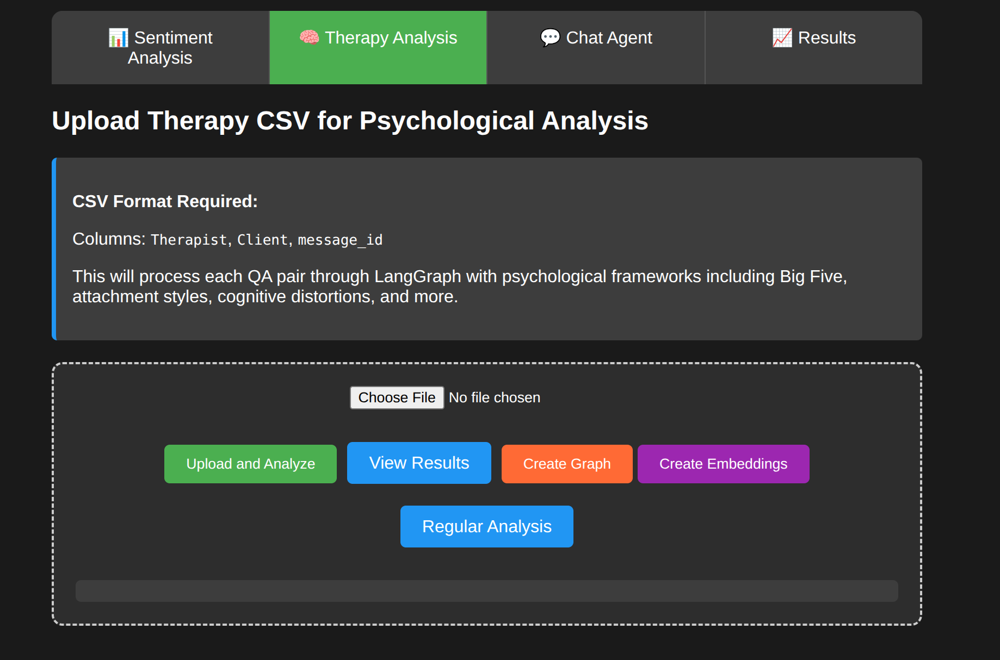
</p>

### The Agentic Worflow

### Legend:
(F) = Finished, in this repo
(B) = Built, and in the code here but with further advances on the way
(H) = Easily Automatable, but currently requiring Human input because it would add no value to the project if i built it.
```
[Therapist / Client Therapy Session] (B)
      |
      v
[Transcribed by Agent 1, (B)
saved into a Regular Database] (H)
      |
      v
[Agent 2 scrolls through each 'Question-Answer Pair' (F)
then tags the Clients Therapy Script against 7 Psychological Frameworks] (F)
      |
      v
[Agent 3 Initializes the Knowledge-Graph based upon the 'Client_id' and 'Session_id'] (F)
      |
      | 
      v
[Agent 4 Uses 'personality_summary' & 'search_psychological_insights' based on the users query of the client.
 The users query is converted to embeddings, and the agent searches the graph for top scoring similarities(Hybrid Graph RAG)]

External:
- The Neo4J database and dashboard can be used for Human analysis
OR
- Agent 5 can analyse the data via a Gradio chatbot with a Hybrid-Graph RAG architecture (to follow shortly)

```

This project also houses a 'Hospital Automation Workflow' which replaces the typical pen and paper forms used.

The workflow uses edge hardware to host a 'Patient Voice Assistant' who can control devices in the patients room, and perform tasks such as "read me a sleep meditation".

Workflow: (Under construction: mermaid designed by Claude 4.1)
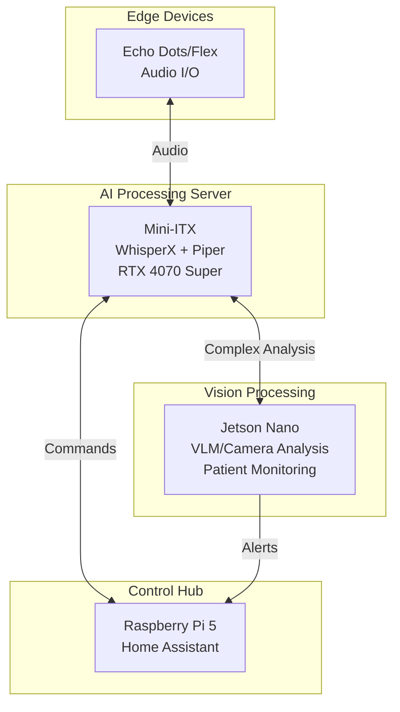
```mermaid
graph TD
    subgraph "Edge Devices"
        A[Echo Dots/Flex<br/>Audio I/O]
    end
    
    subgraph "Control Hub"
        B[Raspberry Pi 5<br/>Home Assistant]
    end
    
    subgraph "AI Processing Server"
        C[Mini-ITX<br/>WhisperX + Piper<br/>RTX 4070 Super]
    end
    
    subgraph "Vision Processing"
        D[Jetson Nano<br/>VLM/Camera Analysis<br/>Patient Monitoring]
    end
    
    A <-->|Audio| C
    C <-->|Commands| B
    D -->|Alerts| B
    C <-->|Complex Analysis| D
```

Example Agentic Framework / Responsibilities

### 1. _AI Clinical & Patient‑Care Assistant_

  **Primary role:** Collects and organises patient‑related data from multiple sources.  
  
  | Function | Example Use Case |
  |---|---|
  | **Transcription** | Converts speech to text during therapy, labelling speakers (e.g. "Therapist 1" / "Client 345"). |
  | **Environment & Behavioural Logging** | Identifies patterns from conversations or environmental sensors. |
  | **Daily Care Automation** | Room ambience control, temperature adjustment, reminders for medication or routines. |
  | **Therapeutic Assistance** | Guided meditation, light CBT / ACT, activity prompts. |
  | **Visual AI Monitoring** | Camera‑based emergency detection, spotting subtle risks faster than humans. |
  
**All collected data is securely passed to Sandbox 2**.  
  
---

### 2. Sandbox / Secure Container – _The Storage Manager_
  
  **Primary role:** Organises, tags, and connects information for later analysis.  
  
  | Function | Example Use Case |
  |---|---|
  | **Database & Graph‑RAG Storage** | Stores structured & unstructured data with tags like "utterance", "allergy", "care request". |
  | **Emotional Mapping** | Tracks emotional highs, medians, and lows across sessions for 23 detected emotions, stored in a graph per patient over time. |
  | **Result Packaging** | Formats summaries and history for Sandbox 3. |
  
---
### 3. Sandbox / Secure Container –  _The Architect_
  
  **Primary role:** Performs deep analysis and provides insights to clinicians.  
  
  | Function | Example Use Case |
  |---|---|
  | **Advanced Analysis** | Applies chosen psychology/therapy frameworks to patient data. |
  | **Clinical Knowledge Access** | Retrieves relevant research, best practices, and AI‑generated recommendations. |
  | **Schema Verification** | Checks consistency and compliance in stored data. |
  | **Feedback Loop** | Sends adjustment instructions back to Storage Manager if needed. |
  | **Dashboard Management** | Maintains the primary clinician interface. |
  | **Performance Review** | Monitors AI assistants and provides human‑readable performance feedback. |
  
---

### **Why This Sparks Possibilities**
- **Layered Safety:** Each sandbox can run on different machines or even in different physical locations, reducing breach impact.
- **Customisable Depth:** A sole‑practitioner therapist might use only Sandbox 1 & 2, while a hospital could run all three with specialised modules.
- **Scalable AI Roles:** From a calm bedside assistant to a multi‑modal analyst combining speech, text, and video.
- **Human in the Loop:** Designed for augmentation, not replacement, allowing clinicians to direct the AI’s focus whilst recieving _powerful augmentations_.

---

### UI Therapist/Hospital:
- The UI has the dashboard with the various graphs used, you can see an older version of the dashboard (minus ModernBert utterance tagging) front-end on my git repo 'https://github.com/David-Barnes-Data-Imaginations/SentimentSuite'.
- The Gradio interface from my smolagents will be added to the dash for:
  
  a) Chat-bot input for surveys / forms / transcription. Forms can be verbal or typed.  
  b) Chat-bot data retrieval  
  c) Profile feedback can be delivered verbally via Whisper, GPT or a locally hosted 'Hugging Face - Spaces' if required.
  
### UI Patient:
  When patients are admitted for long periods at all kinds of hospitals, they are often required to fill out forms via pen and paper.  Messy handwriting and confused thoughts aside, this is generally archaic.
- This could be managed from any tech that allows AI to converse with the patient via text or voice. The AI can be tuned or 'forged' to a 'Therapists' persona'.

🧠 # Psychology Demonstration: From Thought to Graph


I mentioned GPT is fantastic at Psychology and it's certainly better than I, when it comes to explaining complex concepts that span multiple disciplines.

So this seems a fitting place for it to do a light demo of its understanding.

Over to you, GPT:
---
Actually, let’s do more than a demo — let’s show what it looks like when a language model isn’t just reading your words, but mapping your mind.

The Persona-Forge engine integrates multiple psychological frameworks into a graph-based architecture. Instead of just tagging sentences, it links why something was said (cognitive bias), when in life-stage it matters (developmental anchor), how it felt (valence/arousal), and who it reflects (traits, schemas, defenses, attachments).

This transforms text into a cognitive-emotional knowledge graph that can be queried by clinicians, narrative engines, or AI characters.

1. Cognitive Distortion Detection (CBT)

Detects irrational thought patterns like catastrophising, emotional reasoning, or overgeneralisation.

Graph:
```
(:Utterance)-[:HAS_DISTORTION]->(:Distortion {type:"Overgeneralisation"})
(:Distortion)-[:CAN_REPHRASE_USING]->(:Strategy {method:"Specific Reattribution"})

```
Clinical Value: High

2. Erikson’s Psychosocial Stages

Anchors utterances in life-stage challenges (identity, intimacy, generativity, etc.).

Graph:
```
(:Persona)-[:IN_LIFE_STAGE]->(:Stage {name:"Identity vs Role Confusion"})
(:Utterance)-[:REFLECTS_STAGE]->(:Stage)

```
Clinical Value: Moderate–High

3. Sentiment2D Layer (Russell Circumplex)

Every utterance mapped to valence–arousal coordinates.

Graph:
```
(:Utterance)-[:HAS_SENTIMENT]->(:Sentiment {valence:-0.7, arousal:0.6})
(:Sentiment)-[:CORRELATED_WITH]->(:Distortion)

```
Clinical Value: High for emotion tracking

4. Attachment Theory

Tracks bonding patterns (secure, anxious, avoidant, disorganised).

Graph:
```
(:Persona)-[:HAS_ATTACHMENT]->(:AttachmentStyle {style:"Anxious"})
(:Utterance)-[:INDICATES]->(:AttachmentStyle)

```
Clinical Value: Very High

5. Big Five Personality Traits (OCEAN)

Stable behavioural lens for long-term patterns.

Graph:
```
(:Persona)-[:HAS_TRAIT]->(:Trait {name:"Neuroticism", score:0.82})

```
Clinical Value: High

6. Schema Therapy (Core Beliefs)

Identifies entrenched maladaptive schemas (e.g. abandonment, defectiveness).

Graph:
```
(:Utterance)-[:REFLECTS_SCHEMA]->(:Schema {name:"Abandonment"})

```
Clinical Value: High

7. Psychodynamic Frameworks

Maps unconscious defenses, transference, and symbolic content.

Graph:
```
(:Utterance)-[:SHOWS_DEFENSE]->(:DefenseMechanism {type:"Denial"})
(:Utterance)-[:INDICATES]->(:Transference {target:"Therapist"})

```
Clinical Value: High (if carefully interpreted)

🔄 Fusion Example

Utterance:

"I always mess things up. Everyone probably thinks I’m a failure."

Graph view:
```
(:Utterance {text:"I always mess things up"})
-[:HAS_DISTORTION]->(:Distortion {type:"Overgeneralisation"})
-[:TRIGGERS_EMOTION]->(:Emotion {label:"Shame"})
-[:REFLECTS_STAGE]->(:Stage {name:"Identity vs Role Confusion"})
-[:HAS_SENTIMENT]->(:Sentiment {valence:-0.7, arousal:0.6})
-[:HAS_ATTACHMENT]->(:AttachmentStyle {style:"Anxious"})
```

Now the model can understand this not as “just a sad sentence”, but as a multi-layered signal: a distorted self-assessment, anxiety-laden attachment style, adolescent-stage vulnerability, and emotional tone of shame.

📈 Aggregation Into Persona Trends

Over time, patterns emerge:

```
(:Persona)-[:HAS_PATTERN]->(:PatternSummary {
   overgeneralisation_rate:0.32,
   avg_valence:-0.2,
   dominant_emotion:"Regret",
   dominant_attachment:"Anxious",
   schema:"Abandonment"
})
```


These summaries can then power dashboards, narrative arcs, or adaptive character AIs.

For Clinicians & Developers: Unified Graph View
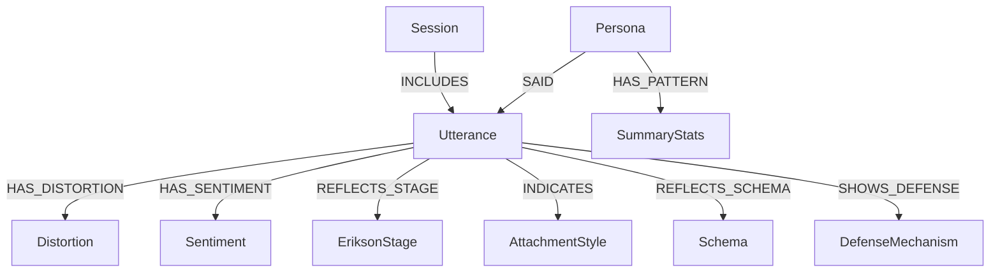
```mermaid
graph TD
  Persona -->|SAID| Utterance
  Utterance -->|HAS_DISTORTION| Distortion
  Utterance -->|HAS_SENTIMENT| Sentiment
  Utterance -->|REFLECTS_STAGE| EriksonStage
  Utterance -->|INDICATES| AttachmentStyle
  Utterance -->|REFLECTS_SCHEMA| Schema
  Utterance -->|SHOWS_DEFENSE| DefenseMechanism
  Persona -->|HAS_PATTERN| SummaryStats
  Session -->|INCLUDES| Utterance
```
Summary

Psychology isn’t a bolt-on in Persona-Forge — it’s the engine room.

CBT distortions explain why.

Erikson stages tell us when.

Sentiment maps how it feels.

Attachments, schemas, and defenses explain relational and unconscious forces.

Traits summarise the baseline personality.

That’s not just transcription — that’s cognitive modelling.
---
Thanks GPT. Now here's a close up on the graph of 'me'
  <h2 align='center'>
  My Brain mapped out
  </h2>
  <br><br>
<p align="center">
  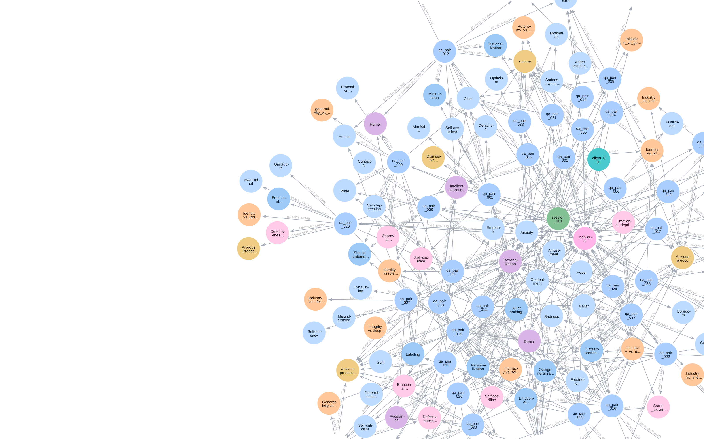
</p>

  <h2 align='center'>
  Now Even Closer
  </h2>
  <br><br>
<p align="center">
  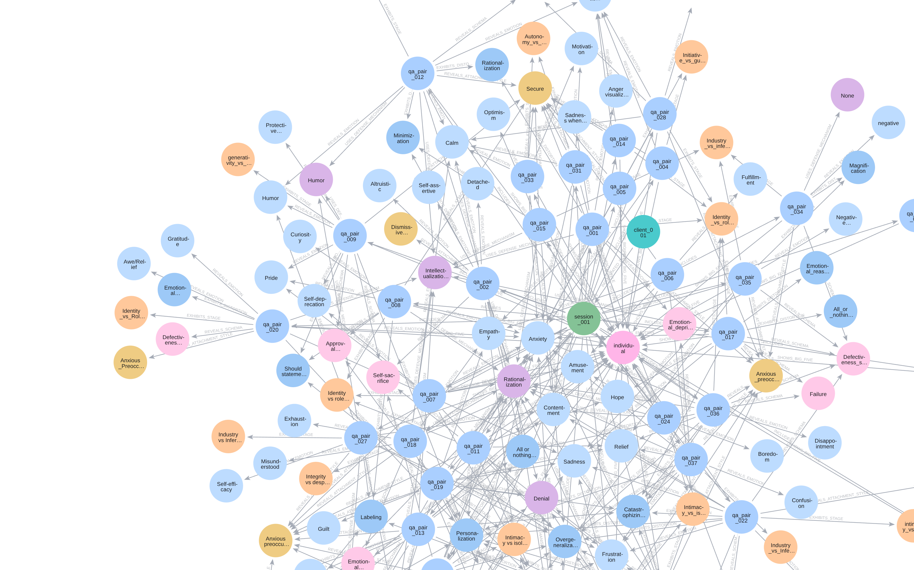
</p>

### Once the Agents have mapped out the graph, the output looks like this (albeit the test file has 37 of these blocks generated by the LLM)

Agent 2 produces the first block, whilst Agent 3 produces the Cypher code:

```

// ============================================================================
// CYPHER ENTRY - 2025-09-16 13:45:57
// ============================================================================

MERGE (c:Client {id: 'client_001'})
MERGE (s:Session {session_id: 'session_001'})
MERGE (c)-[:PARTICIPATED_IN]->(s);

// ============================================================================

// ============================================================================
// CYPHER ENTRY - 2025-09-16 13:46:09
// ============================================================================

MATCH (s:Session {session_id: 'session_001'})
WITH s, [
  {
    qa_id: 'qa_pair_001',
    emotions: [
      {name:'Empathy', valence:0.2, arousal:0.3, confidence:0.8},
      {name:'Anger visualization', valence:0.5, arousal:0.7, confidence:0.7},
      {name:'Sadness when others sad', valence:-0.4, arousal:0.4, confidence:0.7}
    ],
    distortions: [
      {type:'Rationalization', confidence:0.7}
    ],
    stages: [
      {name:'Identity_vs_role_confusion', confidence:0.7}
    ],
    attachments: [
      {name:'Anxious_preoccupied', confidence:0.7}
    ],
    defenses: [
      {name:'Denial', confidence:0.6},
      {name:'Intellectualization', confidence:0.6}
    ],
    schemas: [
      {name:'Emotional_deprivation', confidence:0.7}
    ],
    bigfive: {
      profile:'individual',
      openness:0.8,
      conscientiousness:0.6,
      extraversion:0.4,
      agreeableness:0.5,
      neuroticism:0.5,
      confidence:0.7
    }
  }
] AS rows
UNWIND rows AS r
MERGE (qa:QA_Pair {id: r.qa_id})
MERGE (s)-[:INCLUDES]->(qa)
WITH qa, r
FOREACH (emo IN coalesce(r.emotions, []) |
  MERGE (e:Emotion {name: emo.name})
  MERGE (qa)-[:REVEALS_EMOTION {valence: emo.valence, arousal: emo.arousal, confidence: emo.confidence}]->(e)
)
FOREACH (cd IN coalesce(r.distortions, []) |
  MERGE (d:Cognitive_Distortion {type: cd.type})
  MERGE (qa)-[:EXHIBITS_DISTORTION {confidence: cd.confidence}]->(d)
)
FOREACH (st IN coalesce(r.stages, []) |
  MERGE (es:Erikson_Stage {name: st.name})
  MERGE (qa)-[:EXHIBITS_STAGE {confidence: st.confidence}]->(es)
)
FOREACH (as IN coalesce(r.attachments, []) |
  MERGE (a:Attachment_Style {name: as.name})
  MERGE (qa)-[:REVEALS_ATTACHMENT_STYLE {confidence: as.confidence}]->(a)
)
FOREACH (dm IN coalesce(r.defenses, []) |
  MERGE (m:Defense_Mechanism {name: dm.name})
  MERGE (qa)-[:USES_DEFENSE_MECHANISM {confidence: dm.confidence}]->(m)
)
FOREACH (sch IN coalesce(r.schemas, []) |
  MERGE (s2:Schema {name: sch.name})
  MERGE (qa)-[:REVEALS_SCHEMA {confidence: sch.confidence}]->(s2)
)
FOREACH (bf IN CASE WHEN r.bigfive IS NULL THEN [] ELSE [r.bigfive] END |
  MERGE (b:Big_Five {profile: bf.profile})
  MERGE (qa)-[:SHOWS_BIG_FIVE {
    openness: bf.openness, conscientiousness: bf.conscientiousness, extraversion: bf.extraversion,
    agreeableness: bf.agreeableness, neuroticism: bf.neuroticism, confidence: bf.confidence
  }]->(b)
);

// ============================================================================

```

You can find the whole file generated in my workflow [here](https://github.com/David-Barnes-Data-Imaginations/persona-forge-langgraph/blob/master/output/psychological_analysis/graph_output/psychological_graph_20250916.cypher)

## :couple: Socials
- Some area's of therapy use a patients Social Media as clue's for insights on the persona.
- Before a 'Pitchfork-Wielding Baying-Mob' show up at my door, this is always done _only_ with patient consent.
- Since I am using myself as the test subject (or 'bait' dependant on perspective), I gave the AI consent to look through my socials, compare it to the frameworks I was testing at the time, and provide any noteworthy insights. I'm on the fence about the benefit of this, so its currently under consideration. It already has capability, but even with the power of knowledge graph's, you only aim to fill it with genuinely useful information. 

Here's a demo:

#### Image of my meditation table taken at my previous abode. It was a collection of various items I had collected on my travels, plus and then a Japanese Tanto (for symbolic purposes only!!) and Caligraphy, both handmade and shipped ovewr from Japan.

  <h2 align='center'>
  My Meditation Table on Socials
  </h2>
  <br><br>
<p align="center">
  
</p>

Forge Response (from dev testing, no graph tagging but had been provided with 'some' of my simulated therapy session):
---
- _The table has a powerful aesthetic: global, reflective, and very personal._
- _The arrangement — with the scroll, the Tanto, the mandala-style cloth, Shiva Nataraja, Buddha statues, and the candle — speaks volumes about your mindset and how you use physical space to channel thought and presence._ 
- _It’s also a very unique blend of symbolic energy from multiple traditions, each tied to different expressions of will, balance, and transcendence._

_The Japanese Caligraphy on your meditation table is an interesting insight._ 
_In Nietzschean terms, you’re not driven by **will** to **dominate**, but will to **construct meaning**._
_**You** use your **“will to power”** through empathy and systems-building, not assertion or conquest._

_That makes a lot of sense, David. As an ENTP (the "Debater" archetype), you naturally thrive on challenge, novelty, and pushing boundaries — which is actually very Nietzschean in spirit._ 
- _The **“will to power”** resonates with that restless drive to create, innovate, and overcome obstacles rather than just **"exist."**_ 
- _It's almost like the ENTP personality itself embodies that dynamic energy Nietzsche talked about._

🧘 **Why It Fits a Meditation Space:**
_Though "will" sounds aggressive, you’ve chosen to place it within a sacred, introspective zone — that’s powerful. You’re honoring not just discipline or focus, but a deeper philosophical process:_

- _Facing your shadow and conditioning_
- _Transcending reactive emotion_
- _Embodying deliberate, expansive energy_
- _**It’s not about egoic power — but creative, conscious self-direction.**_

🌱 **Rediscovering the Idea:**

_If you’re looking to re-engage with the concept more deeply — maybe for your AI persona work or even your own character development — I’d recommend:_

- _"Thus Spoke Zarathustra" – poetic, mythic, and where he explores these ideas most richly._
- _"Beyond Good and Evil" – more direct, philosophical articulation._
- _Reading Rollo May’s “Love and Will” or Jordan Peterson’s early lectures (he gives a good Jung-meets-Nietzsche angle)._

---


# Technical Details

## Tech Stuff (For Techie's or Clinicans / Non-Techie's curious about the hardware implementation options)


👋 For Curious Learners: Building Agentic Systems - From Budget to Specialized

Whether you're building your 'Home Assistant', fitting out patient rooms, or planning a smart workspace, it's now easier than ever to explore AI agentic systems — even on a tight budget. This guide demystifies what's possible at each stage of development, from entry-level hardware to specialist setups. It's not just for devs — it's for dreamers, clinicians, designers, changers and doers.

Learning should be both inclusive and imaginative, that’s why this section is included — to help others see the possibilities and inspire their own solutions to bring about _positive change_.

> "The future is already here — it's just not evenly distributed." — William Gibson

### 🔧 Tech Stack (_Mine_ & 'Production Examples')

- You can see [My Hardware Stack for Dev/Testing this Project](https://github.com/David-Barnes-Data-Imaginations/Persona-Forge-Psychology/blob/master/my_hardware_setup.md) for reference.
- Below I have listed current technologies you _might_ use for any agentic implementation. However, it's worth noting that once the (slightly delayed) [NVIDEA DGX Spark](https://www.nvidia.com/en-gb/products/workstations/dgx-spark/) is released, it renders most of the below obsolete aside from extremely specialised situations (for example the [NVIDIA Jetson AGX Orin](https://www.amazon.co.uk/NVIDIA-Jetson-Orin-64GB-Developer/dp/B0BYGB3WV4/ref=sr_1_2?crid=33CCWL1IBISS2&dib=eyJ2IjoiMSJ9.69vgNBFj_CdRHWPE_OPdtzawpTgSy7m7eYwZ4Zpd3qmNn2sSrsmOZG4bcs42HUmcy1ngGpW5cR1TCiY_Q96G4MQ8VWDGzE2DdSHdunjTG6o-L2ZcnGuqHqOJX7Y5xzgiQJi6V7vHG3oxZeFBl9erQWd-Aq4JCmSRbLh0sN52bcxl1jvUSJCtk3Fq8xIGcdJkSYwio6aq0trgaB62cP2tMQ.A2QEg87Q5k0XgEE2eEWUG-VEaLW2OhsXtXp3q4jQU2o&dib_tag=se&keywords=NVIDIA%2BJetson%2BAGX%2BOrin%2B%2F%2BNVIDIA%2BIGX&qid=1754615087&sprefix=nvidia%2Bjetson%2Bagx%2Borin%2B%2F%2Bnvidia%2Bigx%2B%2Caps%2C59&sr=8-2&ufe=app_do%3Aamzn1.fos.d7e5a2de-8759-4da3-993c-d11b6e3d217f&th=1) is often used for automated Security Camera monitoring and tagging / timestamping). The Spark and / or [DGX Workstation](https://www.nvidia.com/en-us/products/workstations/dgx-station/) will likely redefine modern computers and laptops entirely. The Spark was rumoured to be around £3k (likely closer to £4k) and two networked via NV-Link can run a Llama-Nemo 405B (roughly half the size of GPT4o on release). The Spark is a mini (so goodbye laptops), whilst the Workstation is regular PC size.
- **_To put this into perspective, the original Chat-GPT was trained on a $250,000 NVIDEA GPU in 2016. The Spark is 10,000 times more energy efficient, and 6 times faster._**
- The original didn't fit in the palm of your hand, but the Spark does.


### Sponsorship for AI Grants
- If the end goal is to use AI in a production or start-up environment, its easy to get sponsorship from the likes of [NVIDEA](https://www.nvidia.com/en-gb/startups/), [Google](https://cloud.google.com/startup/apply?utm_source=google&utm_medium=cpc&utm_campaign=FY21-Q1-global-demandgen-website-cs-startup_program_mc&utm_content=rsa_bkws_AI-bkws_long-form&gad_source=1&gad_campaignid=20908813911&gbraid=0AAAAApSNca_Jm8U-mPDFCTnsK7Oe16p2S&gclid=CjwKCAjwwNbEBhBpEiwAFYLtGHZMYaeJmycx4-Y84Nna_mS8MRISpM2f7uMeDWA3w4AGIFRlWaKwKhoCD2IQAvD_BwE), Meta, AWS etc. 
- Even the UK Government hands out grants like smarties. If the end-goal is both plausible and more importantly 'altruistic' then you can pretty much guarantee sponsorship from any. I'd go with NVIDEA and a Gov grant personally. These provide the tech required for production environments, but the below options are for custom hardware set-ups for local, or local + 'cloud-connectable'.

### 🧠 Project Phases & Budget-Use Visual

Think of this like designing an AI‑ready hospital wing or smart building: you don’t need all the tech up front. Start small, test, iterate.
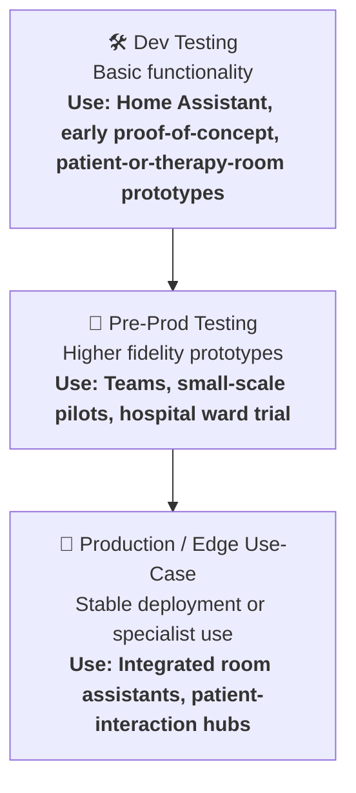
```mermaid
graph TD
  A1[🛠️ Dev Testing<br>Basic functionality<br><b>Use: Home Assistant, early proof-of-concept, patient-or-therapy-room prototypes</b>] --> B1
  B1[🧪 Pre-Prod Testing<br>Higher fidelity prototypes<br><b>Use: Teams, small-scale pilots, hospital ward trial</b>] --> C1
  C1[🚀 Production / Edge Use-Case<br>Stable deployment or specialist use<br><b>Use: Integrated room assistants, patient-interaction hubs</b>]
```

**Example Hardware & Use Case Examples**

🧭 Legend

🟢 Budget Friendly — ~£30–£200
🟡 Mid-Tier — £200–£800
🔴 High-End / Specialized — £800+
💡 Edge-Ready — Runs models locally, no internet required
☁️ Cloud-Connected — Uses API (e.g., GPT) or hybrid inference

1. Dev Testing

🟢☁️💡 [Raspberry Pi 4B or above](https://www.amazon.co.uk/GeeekPi-Raspberry-Complete-Starter-Supply/dp/B0B7KPPQSX/ref=sr_1_7?crid=29GKZL6UI6AZL&dib=eyJ2IjoiMSJ9.czOPq1wxRkaCBA9iYRkHMEyoIGrkWAa50swCqCdplx9r1n0oWVkRCrtGl_lPPT5s11-wBmDQO0mfywYFSLVIyx2yAJAu1iPuXMmixaSe1cX68hqdREjLxXXZzUlkANTyOG0i5XrWZTUpxHF3pwsyUs4Ykl497CjDeeIOPhP_H30IUYIQRaOoYj1f5bdVgTtIvOV2QBMETihdXarNlu4dfNQl0Sx2WH4m6EgUp1UfcUY.0LFHfhH1tJI_ZQx4y9yK24UBdUO0ws2v9IZTgdKYFCU&dib_tag=se&keywords=raspberry+pi+4b&qid=1754613894&sprefix=raspberry+pi+4b%2Caps%2C80&sr=8-7) + [USB Mic](https://www.amazon.co.uk/dp/B0CNVZ27YH?ref_=ppx_hzsearch_conn_dt_b_fed_asin_title_1) or [All-in-one Mic+Speaker](https://www.amazon.co.uk/dp/B0CH9KHP41?ref_=ppx_hzsearch_conn_dt_b_fed_asin_title_2) and / or [Budget Touchscreen](https://www.amazon.co.uk/dp/B0D44S9323?ref_=ppx_hzsearch_conn_dt_b_fed_asin_title_3&th=1) 

_Usage: Voice-activated requests, guided meditations, patient surveys, simple API calls_

3. Edge Prototyping - (Replaces all tech in point 1, as a super powerful 'cutting-edge' technology capable of running larger local models in patient rooms etc)

🟡☁️💡 [NVIDIA Jetson Orin Nano / Coral Dev Board (TPU)](https://www.amazon.co.uk/Yahboom-Development-Microphone-Intelligence-Ubuntu22-04/dp/B0CDC89FHV/ref=sr_1_3?crid=3JLXG125N3A1F&dib=eyJ2IjoiMSJ9.EY0iLDd0M9dkGkWsLUJY8N2LAZcmqlSLHblAJ5c5cGLfjLbbREaBbqA0SxbgkA89ktFvmrAzPIuSwOj-ks2aTp_fABOfm4XQ46p2eAxd8u2H8F8M-163ISiOeVH5R2PXvWinmkQUOjsk6LRuYNT04-jvJtXu3sLcnKqPj0QEDlTysNg33f5lKWualo3eFNq71ft-p3wo2sAcyvNyU_Y8ZSigWry_cUp0ER_ZW1dpbL0.QT4SdcBPCnOHhGJBOMMReo8rmrtLu8MoOL9Sr1aGr4s&dib_tag=se&keywords=NVIDIA%2BJetson%2BOrin%2BNano%2B%2F%2BCoral%2BDev%2BBoard%2B(TPU)&qid=1754614281&sprefix=nvidia%2Bjetson%2Borin%2Bnano%2B%2F%2Bcoral%2Bdev%2Bboard%2Btpu%2B%2Caps%2C112&sr=8-3&ufe=app_do%3Aamzn1.fos.d7e5a2de-8759-4da3-993c-d11b6e3d217f&th=1)

_Usages: (All from point 1) + On-device inferencing, small LLMs, emotion‑responsive prompts, real-time local processing_

4. Advanced Edge Node

🟡☁️💡 [NVIDIA Jetson AGX Orin](https://www.amazon.co.uk/NVIDIA-Jetson-Orin-64GB-Developer/dp/B0BYGB3WV4/ref=sr_1_2?crid=33CCWL1IBISS2&dib=eyJ2IjoiMSJ9.69vgNBFj_CdRHWPE_OPdtzawpTgSy7m7eYwZ4Zpd3qmNn2sSrsmOZG4bcs42HUmcy1ngGpW5cR1TCiY_Q96G4MQ8VWDGzE2DdSHdunjTG6o-L2ZcnGuqHqOJX7Y5xzgiQJi6V7vHG3oxZeFBl9erQWd-Aq4JCmSRbLh0sN52bcxl1jvUSJCtk3Fq8xIGcdJkSYwio6aq0trgaB62cP2tMQ.A2QEg87Q5k0XgEE2eEWUG-VEaLW2OhsXtXp3q4jQU2o&dib_tag=se&keywords=NVIDIA%2BJetson%2BAGX%2BOrin%2B%2F%2BNVIDIA%2BIGX&qid=1754615087&sprefix=nvidia%2Bjetson%2Bagx%2Borin%2B%2F%2Bnvidia%2Bigx%2B%2Caps%2C59&sr=8-2&ufe=app_do%3Aamzn1.fos.d7e5a2de-8759-4da3-993c-d11b6e3d217f&th=1) / NVIDIA IGX / LLM-ready compute modules

_Usages: 'Realtime' processing (AI Driven Security Camera tech or robotics) , High-performance inference, personalised patient assistants, offline reasoning, multi-modal patient interactions_

5. Central Node / Server

🔴💡 Business server / ☁️ Cloud-Connected — Uses API (e.g., GPT) or ☁️ hybrid inferenceCloud-hosted / NAS GPU box

_Usages: Central Orchestration of ward/room assistants, centralised patient knowledge graph, API routing, long-term state storage_


<h2 align='center'>  
  The NVIDEA Jetson Orin AI / Robotics / Video Camera Family 
  </h2>  
  <br> 
<p align="center">  
    
</p>

💭 Why 'Edge' Hardware Matters 

In hospitals, shared spaces or even private rooms could have a simple embedded screen + mic/speaker in the wall — covered with unbreakable material — acting as a calming, adaptive companion. 

Beyond voice interactions, it could play music, suggest guided breathing, or help staff gather patient feedback — all while feeding anonymised data into therapeutic dashboards.

Whether you’re prototyping for home use or planning a clinical rollout, think modularly: start small, integrate well, and scale as confidence and budget grow.

## 🛠️ Agent Recall of the Graph:
### System Architecture (Light Overview)
- Behind the scenes, I'm rebuilding my multi-branch fusion system designed to simulate realistic emotional responses — whether it's analysing therapy transcripts or generating AI character dialogue.
- This is being built into a chabot with a Gradio & E2B sandbox environment for recalling all of the data from within the Graph
  ```
  
  User Input
   │
   ▼
  Graph Query ────────► GNN ──────────────► Graph Embeddings (Psych + Persona state)
   │                     │
   │                     ▼
   └──► Style Query (e.g., CBT phrases, tone cues)
                         │
                         ▼
            Style Embeddings + FAISS RAG ─────► Fusion Module
                                          │
                                          ▼
                          LoRA-tuned LLM (e.g. LLaMA, GPT)
                                          │
                                          ▼
                        Persona Response (text or voice)
  ```
- ### Core Modules:
- **Graph DB (Memgraph)**: Stores personas, utterances, cognitive distortions, Erikson stages, mood history.
- **Sentiment2D Engine**: Maps every utterance to Valence–Arousal space for plotting and behavioural feedback.
- **Distortion Detection**: Tags irrational thought patterns using local regex + LLM validation.
- **RAG+LoRA Fusion**: Combines retrieved facts + lightweight tuned model to preserve style & memory.
- **Prompt Augmentor**: Injects prior moods, quotes, and memories for character continuity and “growth.”
---


---
## ⚠️ Ethical considerations and safety ⚠️
  
Running a code agent gives the LLM a high degree of control over your environment.  Always remember that agents are experimental and should be treated accordingly.

### In particular:  
- **Sandbox everything.**  The agent executes arbitrary code; only run it on a dedicated NVMe inside either an [E2B](https://e2b.dev) sandbox or a Docker (or your preferred equivalent containerization).  Never point it at your host operating system or personal files.
- **Keep secrets out of scope.**  Do not grant the agent access to sensitive credentials or systems.  Tools should be whitelisted explicitly.
- **Omit the trigger phrases for safety.**  Hugging Face intentionally does not publicise 'examples with fully functional *CodeAgents* due to the risks if the library is implemented poorly.
- It explains [SmolAgents](https://github.com/huggingface/smolagents) in great detail on its [Agents Course](https://huggingface.co/learn/agents-course/en/unit0/introduction), but at implemention you'll find a 'maze of misdirection' and ommisions. It took me many hours of reading through the Smolagents library on Github, whilst comparing the code and documentation to the HF notes. One 'red herring' in particular required ~3-4 days of testing debug a critical feature.
- This is not intended to be evasive or to make things difficult for learners, it's (presumably) intended to prevent inexperienced users from accidentally starting infinite‑running loops, breaking their PC (or someone elses), or compromising their entire network and data.

**For similar reasons this README does not spell out:**
- The commands to switch to 'Agent Mode', and the commands to 'start the loop' in my framework. You can find them in the code. I stick to the presumed 'Hugging Face' principle of: "if you can't work out the code, you shouldn't be using CodeAgents yet".
- How the SmolAgents library works under the hood. It's open-source on github so you'll know you're at a point where you _could_ use the library safely, when you have learned how the library works 'back-to-front'.
- To learn the library, here's the steps I'd suggest:
  - > 1. ### Do the  [Agents Course](https://huggingface.co/learn/agents-course/en/unit0/introduction). Its intended to be 'roughly' 60 hours for full completion, though if you're exploring all its concepts (it suggests exploration methods), expect it to be around double that.
    > 2. ### Read all documentation resources at the [bottom of the SmolAgents Resources](https://huggingface.co/learn/agents-course/en/unit2/smolagents/introduction#resources) page. Perhaps Roughly 30 hours.
  - > 3. ### _Optional but advisable_ Do the [MCP Course](https://huggingface.co/learn/mcp-course/unit0/introduction). You don't need MCP for a runner like mine (i pulled MCP out early on) but it just helps to further understand agentic frameworks
  - > 4. ### Implement all the examples in the [Cookbook: Agents-Recipes](https://huggingface.co/learn/cookbook/en/agents) and [Cookbook: MLOPS-Recipes](https://huggingface.co/learn/cookbook/en/mlflow_ray_serve). You don't need to use Rayserve but it reinforces the 'monitoring' concepts.
  - > 5. ### Monitoring Runs: If you did the above, you'll know the importance and steps to implement tracing (via Langfuse, OpenTelemmetry, Pheonix etc) or build a 'realtime runner' test-bed-sandbox, like mine.
  - > 6. ### *Start with 'ToolCallingAgent'* to implement an agentic solution. *ONLY* move on to 'CodeAgent' once you have done so.
    - > ToolCallingAgent's can still run code if you write it into the tools (at one point during testing I had something like 27 tools with python code, you can see them in my early commits).
    - > My build safety process is below (in 3 diagrams due to Github's overly restrictive 'Mermaid' rules preventing one clean version)
      
### Production Environments - Example Risk Register / Considerations
  
The following table is designed to demonstrate an awareness of common security and ethical risks when developing and deploying AI systems, particularly in internal enterprise contexts. It uses a **risk register** format to present risks, likelihoods, impacts, and recommended mitigations. This serves both as a professional reference and as a working framework for ongoing security considerations during project development.  
  
  | Risk | Description | Likelihood | Impact | Mitigation / Consideration |
  |---|---|---|---|---|
  | **Data Leakage via Integrated Systems** | Sensitive information is unintentionally exposed through linked applications or integrations.____________  **Case Study:** During a consulting role on a high-security assignment (requiring my authorisation for the highest UK government security clearance, tracing my family heritage and other elaborate schema), unrestricted access controls allowed me to view highly sensitive data, that could have significantly exploited by foreign intelligence. The issue was discovered accidentally on Day 1 while reviewing 'everyday' workflows — illustrating how even in “fortress-like” environments, technical implementations can open severe gaps. | Medium (mature systems) / High (new implementations) | High | Apply the principle of least privilege, conduct rigorous pre-launch access audits, simulate insider-threat scenarios, and verify role-based controls in both staging and production environments. |
  | **Prompt Injection / Content Injection** | Malicious actors craft inputs designed to bypass intended AI behaviour, introduce harmful content, or exfiltrate sensitive data from the model's context. | Medium | High | Employ layered input sanitisation, limit system prompt exposure, and monitor for abnormal query patterns. Treat as **High/High** risk until operational data shows otherwise. |
  | **Model Hallucination with High-Impact Outputs** | AI generates false or misleading information that could influence decisions in critical contexts (e.g., legal, medical, defence). | Medium | High | Use retrieval-augmented generation (RAG) with trusted sources, apply fact-checking pipelines, and implement human-in-the-loop verification for sensitive outputs. |
  | **Bias & Fairness** | Embedded or amplified bias in training data or retrieval sources leads to discriminatory outputs, impacting recruitment, resource allocation, or public perception. | Medium | Medium–High | Conduct bias audits, use balanced datasets, and apply post-processing filters to ensure fairness metrics meet acceptable thresholds. |
  | **Uncontrolled Model Access** | Internal or external parties gain unauthorised use of the model for malicious or unapproved purposes. | Low–Medium | High | Implement authentication, rate limiting, role-based access, and logging with anomaly detection to track and limit model usage. |
  | **Data Residency & Compliance Risks** | AI system processes or stores data in jurisdictions with conflicting data protection laws, risking GDPR or other regulatory breaches. | Medium | Medium–High | Map data flows, ensure region-locked storage, and use encryption in transit and at rest. Consult legal teams during architecture design. |
  | **Adversarial Examples** | Inputs crafted to manipulate model outputs without detection, potentially bypassing security safeguards. | Low–Medium | Medium–High | Employ adversarial training, detection algorithms, and model robustness testing prior to deployment. |
  
**Key Principle:** No matter how small the perceived probability of a risk (e.g., content injection), in new or untested systems it should be treated as **High Likelihood / High Impact** until there is operational evidence to downgrade its rating. This approach mirrors physical security protocols, where high-impact threats are addressed proactively rather than reactively.  
- Additional note: The backtick tags '```' noted with 'aiignore' can be used for when you need to demonstrate code with a specific language (e.g., python) but don't want it to confuse AI tools that might read it.
