# Project Structure
```
<PROJECT_DIR>
├─ **SentimentSuite.py # the app front end (not used for the terminal based workflow).**
│  ├─ **workflow 4 - run_deep_agent_e2b.py # langgraph Deep Agent for the terminal workflow.**
├─ src/
│  ├─ voice_service_faster.py # This is the file 'faster-whisper' implementation of TTS used with chat_agent.
│  ├─ graphs/
│  │  ├─ framework_analysis.py # **Workflow 1 - Used for the 'psychological-results' from sentiment_suite.py**.
│  │  ├─ create_kg.py # Workflow 2 - for creating cypher for graph and embeddings (for Hybrid Graph-RAG).
│  │  ├─ deep_agent.py # Workflow 4 - The Deep Agent base workflow
│  │  ├─ chat_agent.py # workflow 3 The langgraph chatbot agent, to be updated at some point with 'AG_UI': LARGE FILE.
│  ├─ analysis/ # files from simple sentiment workflow (in sentiment_suite.py), they instead use a well known 'Carl and Gloria' therapy transcription.
│  │  ├─ circumplex_plot.py # Just for the circular 'Russell's Circumplex' visualization.
│  │  ├─ emotion_mapping.py # For the 23 emotions to add to circumplex.
│  │  ├─ enhanced visualization.py # Just front end dashboard stuff.
│  │  ├─ sentiment_dashboard_tabs.py # the code for the tabbed dashboard.
│  ├─ prompts/
│  │  ├─ **e2b_prompts.py** # the prompts, heavily adapted from Deep Agents: LARGE FILE.
│  │  ├─ text_prompts.py # the prompts for workflows 1-3.
│  ├─ utils/
│  │  ├─ io_py/
│  │  │ ├─edge/
│  │  │ │  ├─config.py # config file for all models.
│  │  │ │  ├─ssh_tunnel.py # ssh tunnel to allow for models on other PC's on my network
│  ├─ agent_utils/
│  │  ├─ **deep_utils.py** # **'Deep Agents' code for formatting langgraph messages** .
│  │  ├─ **state.py** # **'Deep Agents' for state handling with todo's etc** .
│  ├─ tools/
│  │  ├─ text_graph_tools.py # This has the tool used in 'create_kg' and 'framework_analysis' workflows.
│  │  ├─ **e2b_tools.py** # Replaces'Deep Agents' virtual filesystem instead using e2b kernel.
│  │  ├─ **task_tool.py** # basic 'Deep Agents' code for creating a sub-agent.
│  │  ├─ **todo_tools.py** # basic 'Deep Agents' code for todo lists. 
│  │  ├─ **research_tools.py** # customized deep agent tools for for web search and pubmed search.
│  │  ├─ **hybrid_rag_tools.py** # Hybrid Graph-RAG tools for deep agent and chat agent workflows.
│  │  ├─ **file_tools.py** # Adapted from Deep Agents. File handling utilities for reading, writing, and deleting files within the project structure.
│  ├─ terminal/
│  │  ├─ **admin_assistant.py** - my unfinished attempt at converting my previous terminal helper. To be used as UI for 'Deep Agent'.
├─ output/
│  ├─ psychological_analysis/
│  │  ├─ psychological_analysis_master.txt # This is where framework_analysis outputs 'to', where 'create_kg' outputs from': HUGE FILE.
│  │  ├─ graph_output/
│  │  │ │  ├─psychological_graph_20250916.cypher # 'create_kg' output file: HUGE FILE.
│  │  ├─ workflow_1_output_examples.txt/ # Example output from 'framework_analysis'.
│  │  ├─ workflow_2_output_examples.txt/ # Example output from 'create_kg'.
│  ├─ ui/
│  │  ├─ langgraph_chat.py # The gradio front end for the actual chatbot: LARGE FILE.
│  ├─ ui/
│  │  ├─ utils/
│  │  │ │  ├─context_manager.py # Context window manager to remove older messages from langgraph messagesstate
│  │  │ │  ├─embeddings.py # embeddings utils
├─ run_notes/
│  ├─ data/
│  │  ├─ psychological_analysis_master.txt # This is where framework_analysis outputs 'to', where 'create_kg' outputs from'. HUGE FILE.
│  │  ├─ knowledge_corpus/
│  │  │ │  ├─how_to_write_progress_notes.md # research on 'Progress Notes' since I'm not an _actual_ psychologist despite being knowledgable.
│  │  │ │  ├─soap_notes_and_examples.md # research on 'Progress Notes' since I'm not an _actual_ psychologist despite being knowledgable.
│  │  ├─ therapy_csvs/
│  │  │ │  ├─therapy-fin.csv
│  │  │ │  ├─therapy-fin_fixed.csv

```

## Usage Instructions

> I have set this up to run with Ollama for ease of use. These can be adapted to use online or other local model providers by editing 'config.py' and adapting the langchain ollama blocks in the 'src/graphs/' files. A gemini api key is also required unless the model provider is changed in 'deep_agent.py', 'hybrid_rag_tools.py' and 'research_tools.py'.

> The workflows are much quicker using online models, Ollama models take around 1-3 hours to complete 'create_kg' and 'framework_analysis'. I've set these to gemini for ease of use for the user.

1. Download all project files. Rename the data_pub directory to just 'data', and rename the 'therapy_fictional.csv' to 'therapy_working.csv' (see also 'creating your own therapy script'). 

Also download all files in this repo (into project_dir: https://huggingface.co/deepdml/faster-whisper-large-v3-turbo-ct2/tree/main). 

Also download 'https://huggingface.co/rhasspy/piper-voices/tree/main/en/en_GB/alba/medium'. I use ubuntu and have that in my home dir, but you can change to your favoured TTS (in SentimentSuite.py).

Install piper on your system if not already.

2. Create a venv `uv venv` and activate it. `source .venv/bin/activate`  
3. Install from requirements.txt: `uv pip install -r requirements.txt`
4. Here are the services you need to start each time:
a) Use start_services.sh
OR
b)
Backend API (required for tools/graphs):
`uv run uvicorn ag_ui_backend:app --reload --port 8001 --host 127.0.0.1`
React Frontend:
`cd sentiment-ag-ui && npm run dev`
LM Studio - Just launch the LM Studio app and make sure your model is loaded on port (default) 1234. Make sure your LM Studio has 'openai/gpt-oss-20b' loaded.
5. The first langgraph workflow uses 'framework_analysis.py' to tag the script. Upload a file with this format (therapy_fictional.csv is made for you if you want to test):

```
Therapist,Client,message_id
"Question","Answer",001
"Question","Answer",002
```
6. The second langgraph workflow uses 'create_kg' to create the knowledge graph. 

Click on 'create graph' to begin the Cypher workflow. Paste the output file into neo4j in one go (i'll add an automation for this shortly).

All the embeddings for hybrid-graph-rag are created for you.

7. In the port 8000 app, click onto chat for the voice activated chat mode. Check the 'transcribe' and 'voice mode' buttons then chat away.

### Creating your own therapy script

LLM's have clearly been trained on lots of therapy scripts, since they are great at it. 

You can either generate your own session with an LLM (put it in the data file in the afforementioned format), and you can then use 'fixes/anonomize_therapy_csv.py' to change the story and modify the themes that occur.

You can also just ask an LLM to generate these files with your chosen topics and context. The app will analyse any amount of text, The langgraph workflow are specifically designed for long context answers from a text-based therapy script, whilst the sentiment analysis dashboard is designed for video transcript scripts (use the 'Carl and Gloria' cleaned CSV in the data file)

## Required Environment variables

OPENAI_API_KEY="sk-proj-"
LANGSMITH_API_KEY="lsv2_"
LANGSMITH_TRACING_V2=true
ANTHROPIC_API_KEY=""
LANGSMITH_PROJECT="langchain-academy"
TAVILY_API_KEY="tvly-dev-"
USE_HOST_OLLAMA=true
OLLAMA_HOST="http://localhost:11434"
OLLAMA_EMBED_MODEL="nomic-embed-text:latest"

# Neo4j Configuration
NEO4J_URI="bolt://localhost:7687"
NEO4J_USER="neo4j"
NEO4JP="your_password"

HUGGINGFACE_TOKEN="hf_p"

# Cypher Generation LLM Configuration
# Set to "anthropic" to use Claude API, or "ollama" for local generation
CYPHER_LLM_PROVIDER="gemini"
CYPHER_OLLAMA_MODEL="gpt-oss:20b"
CYPHER_ANTHROPIC_MODEL="claude-3-5-sonnet-20241022"
CYPHER_GEMINI_MODEL="gemini-2.0-flash-exp"
# Add your Anthropic API key here when using Claude
ANTHROPIC_API_KEY="sk-ant-api03-ile"
GEMINI_API_KEY="AIza"

E2B_API_KEY="e2b_"
E2B_ACCESS_TOKEN="e2b"
E2B_TEAM_ID="70e8"
USE_E2B=true
copilotKit_publicApiKey="ck_pub_"
CopilotKit_publicLicenseKey="ck_pub_

OPENAI_API_KEY=lm-studio
OPENAI_BASE_URL=http://127.0.0.1:1234/v1

**Running the Deep Agent workflow:**

This is a little more complex, since I use multiple PC's hosting local agents. The easiest way to change this is to ask your VS Code AI (Claude or whatever, but it needs terminal control) to change all the lm-studio model instances to your chosen online model.

You can also editrun_deep_agent_e2b.py and 'src/graphs/deep_agent.py'. For example you would want to switch instances of:

`from langchain_openai import ChatOpenAI`

and

```
# Local models (main PC) - LM Studio configuration
alt_model = ChatOpenAI(
    model=LLMConfigPeon.model_name,  # aka 'alt'
    temperature=LLMConfigPeon.temperature,
    max_tokens=LLMConfigPeon.max_tokens,
    base_url="http://localhost:1234/v1",  # LM Studio's OpenAI-compatible endpoint
    api_key="lm-studio",  # LM Studio doesn't require a real key
)
```

to the notation for langgraph gemini:

```
import google.generativeai as genai


def get_gemini_model():
    """Initialize Gemini model using direct Google API."""
    api_key = os.getenv("GOOGLE_API_KEY")
    if not api_key:
        raise ValueError("GOOGLE_API_KEY not found in environment variables")

    genai.configure(api_key=api_key)

    return genai.GenerativeModel(
        model_name="gemini-2.0-flash-exp",
        generation_config={
            "temperature": 0.7,
            "max_output_tokens": 2048,
        }
    )

```

then run 'run_deep_agent_e2b.py'. Whilst it has a full front-end to look like Claude code, I have this set up so it pastes the prompt in to save you needing to do that each time.

**Important!**: You need to match my e2b versions or use earlier, since the later versions borked the API method.

**Context Manager Functions**

A functionality I implemented in ‘context_manager.py’ is a powerful block of code that removes or summarizes the agents history based upon a number of tokens. For example, once 60k tokens has been reached, it will access the langchain ‘messagesstate’ to lop off the older tokens. This is highly effective for reducing confusion in the workflow as the agents work, and can be implemented with minimal changes dependant on the data structure used in the agentic framework.

**TODO Lists and Subagents** 

Langchain released their ‘Deep Agents’ library alongside Langchain 1.0 in summer 2025. The library features a simple but effective functionality for managing multi-agent workflows, specifically to manage context. The Deep Agent library builds upon the ‘create agent’ abstraction to add tools for agentic workflow such as ‘TODO Lists’, a ‘Virtual Filesystem’ and ‘Subagents’.

Whilst the Virtual filesystem is useful for prototyping, I prefer my agents to run on their own computer using an E2B linux kernel, and sandboxed filesystem, so I modified the library to instead use this. Therefore allowing my agents to create ‘real’ files as part of their workflow, a setup I also find easier to run Evals on.

Deep agents can spawn sub-agents at will, allowing those sub-agents to complete tasks without adding to the primary agents context. I typically use ‘GPT-OSS’ with reasoning, so it’s important to manage the context window with ‘Test-Time-Compute’ tokens factored in. In practice, reasoning or ‘thinking’ can often require more tokens than the actual output.


# Technical Details

### 🔧 Tech Stack (_Mine_ & 'Production Examples')

- You can see [My Hardware Stack for Dev/Testing this Project](https://github.com/David-Barnes-Data-Imaginations/Persona-Forge-Psychology/blob/master/my_hardware_setup.md) for reference.
- Below I have listed current technologies you _might_ use for any agentic implementation. However, it's worth noting that once the (slightly delayed) [NVIDEA DGX Spark](https://www.nvidia.com/en-gb/products/workstations/dgx-spark/) is released, it renders most of the below obsolete aside from extremely specialised situations (for example the [NVIDIA Jetson AGX Orin](https://www.amazon.co.uk/NVIDIA-Jetson-Orin-64GB-Developer/dp/B0BYGB3WV4/ref=sr_1_2?crid=33CCWL1IBISS2&dib=eyJ2IjoiMSJ9.69vgNBFj_CdRHWPE_OPdtzawpTgSy7m7eYwZ4Zpd3qmNn2sSrsmOZG4bcs42HUmcy1ngGpW5cR1TCiY_Q96G4MQ8VWDGzE2DdSHdunjTG6o-L2ZcnGuqHqOJX7Y5xzgiQJi6V7vHG3oxZeFBl9erQWd-Aq4JCmSRbLh0sN52bcxl1jvUSJCtk3Fq8xIGcdJkSYwio6aq0trgaB62cP2tMQ.A2QEg87Q5k0XgEE2eEWUG-VEaLW2OhsXtXp3q4jQU2o&dib_tag=se&keywords=NVIDIA%2BJetson%2BAGX%2BOrin%2B%2F%2BNVIDIA%2BIGX&qid=1754615087&sprefix=nvidia%2Bjetson%2Bagx%2Borin%2B%2F%2Bnvidia%2Bigx%2B%2Caps%2C59&sr=8-2&ufe=app_do%3Aamzn1.fos.d7e5a2de-8759-4da3-993c-d11b6e3d217f&th=1) is often used for automated Security Camera monitoring and tagging / timestamping). The Spark and / or [DGX Workstation](https://www.nvidia.com/en-us/products/workstations/dgx-station/) will likely redefine modern computers and laptops entirely. The Spark was rumoured to be around £3k (likely closer to £4k) and two networked via NV-Link can run a Llama-Nemo 405B (roughly half the size of GPT4o on release). The Spark is a mini (so goodbye laptops), whilst the Workstation is regular PC size.
- **_To put this into perspective, the original Chat-GPT was trained on a $250,000 NVIDEA GPU in 2016. The Spark is 10,000 times more energy efficient, and 6 times faster._**
- The original didn't fit in the palm of your hand, but the Spark does.


### Sponsorship for AI Grants
- If the end goal is to use AI in a production or start-up environment, its easy to get sponsorship from the likes of [NVIDEA](https://www.nvidia.com/en-gb/startups/), [Google](https://cloud.google.com/startup/apply?utm_source=google&utm_medium=cpc&utm_campaign=FY21-Q1-global-demandgen-website-cs-startup_program_mc&utm_content=rsa_bkws_AI-bkws_long-form&gad_source=1&gad_campaignid=20908813911&gbraid=0AAAAApSNca_Jm8U-mPDFCTnsK7Oe16p2S&gclid=CjwKCAjwwNbEBhBpEiwAFYLtGHZMYaeJmycx4-Y84Nna_mS8MRISpM2f7uMeDWA3w4AGIFRlWaKwKhoCD2IQAvD_BwE), Meta, AWS etc. 
- Even the UK Government hands out grants like smarties. If the end-goal is both plausible and more importantly 'altruistic' then you can pretty much guarantee sponsorship from any. I'd go with NVIDEA and a Gov grant personally. These provide the tech required for production environments, but the below options are for custom hardware set-ups for local, or local + 'cloud-connectable'.

### 🧠 Project Phases & Budget-Use Visual

Think of this like designing an AI‑ready hospital wing or smart building: you don’t need all the tech up front. Start small, test, iterate.

```mermaid
graph TD
  A1[🛠️ Dev Testing<br>Basic functionality<br><b>Use: Home Assistant, early proof-of-concept, patient-or-therapy-room prototypes</b>] --> B1
  B1[🧪 Pre-Prod Testing<br>Higher fidelity prototypes<br><b>Use: Teams, small-scale pilots, hospital ward trial</b>] --> C1
  C1[🚀 Production / Edge Use-Case<br>Stable deployment or specialist use<br><b>Use: Integrated room assistants, patient-interaction hubs</b>]
```


**Example Hardware & Use Case Examples**

🧭 Legend

🟢 Budget Friendly — ~£30–£200
🟡 Mid-Tier — £200–£800
🔴 High-End / Specialized — £800+
💡 Edge-Ready — Runs models locally, no internet required
☁️ Cloud-Connected — Uses API (e.g., GPT) or hybrid inference

1. Dev Testing

🟢☁️💡 [Raspberry Pi 4B or above](https://www.amazon.co.uk/GeeekPi-Raspberry-Complete-Starter-Supply/dp/B0B7KPPQSX/ref=sr_1_7?crid=29GKZL6UI6AZL&dib=eyJ2IjoiMSJ9.czOPq1wxRkaCBA9iYRkHMEyoIGrkWAa50swCqCdplx9r1n0oWVkRCrtGl_lPPT5s11-wBmDQO0mfywYFSLVIyx2yAJAu1iPuXMmixaSe1cX68hqdREjLxXXZzUlkANTyOG0i5XrWZTUpxHF3pwsyUs4Ykl497CjDeeIOPhP_H30IUYIQRaOoYj1f5bdVgTtIvOV2QBMETihdXarNlu4dfNQl0Sx2WH4m6EgUp1UfcUY.0LFHfhH1tJI_ZQx4y9yK24UBdUO0ws2v9IZTgdKYFCU&dib_tag=se&keywords=raspberry+pi+4b&qid=1754613894&sprefix=raspberry+pi+4b%2Caps%2C80&sr=8-7) + [USB Mic](https://www.amazon.co.uk/dp/B0CNVZ27YH?ref_=ppx_hzsearch_conn_dt_b_fed_asin_title_1) or [All-in-one Mic+Speaker](https://www.amazon.co.uk/dp/B0CH9KHP41?ref_=ppx_hzsearch_conn_dt_b_fed_asin_title_2) and / or [Budget Touchscreen](https://www.amazon.co.uk/dp/B0D44S9323?ref_=ppx_hzsearch_conn_dt_b_fed_asin_title_3&th=1) 

_Usage: Voice-activated requests, guided meditations, patient surveys, simple API calls_

3. Edge Prototyping - (Replaces all tech in point 1, as a super powerful 'cutting-edge' technology capable of running larger local models in patient rooms etc)

🟡☁️💡 [NVIDIA Jetson Orin Nano / Coral Dev Board (TPU)](https://www.amazon.co.uk/Yahboom-Development-Microphone-Intelligence-Ubuntu22-04/dp/B0CDC89FHV/ref=sr_1_3?crid=3JLXG125N3A1F&dib=eyJ2IjoiMSJ9.EY0iLDd0M9dkGkWsLUJY8N2LAZcmqlSLHblAJ5c5cGLfjLbbREaBbqA0SxbgkA89ktFvmrAzPIuSwOj-ks2aTp_fABOfm4XQ46p2eAxd8u2H8F8M-163ISiOeVH5R2PXvWinmkQUOjsk6LRuYNT04-jvJtXu3sLcnKqPj0QEDlTysNg33f5lKWualo3eFNq71ft-p3wo2sAcyvNyU_Y8ZSigWry_cUp0ER_ZW1dpbL0.QT4SdcBPCnOHhGJBOMMReo8rmrtLu8MoOL9Sr1aGr4s&dib_tag=se&keywords=NVIDIA%2BJetson%2BOrin%2BNano%2B%2F%2BCoral%2BDev%2BBoard%2B(TPU)&qid=1754614281&sprefix=nvidia%2Bjetson%2Borin%2Bnano%2B%2F%2Bcoral%2Bdev%2Bboard%2Btpu%2B%2Caps%2C112&sr=8-3&ufe=app_do%3Aamzn1.fos.d7e5a2de-8759-4da3-993c-d11b6e3d217f&th=1)

_Usages: (All from point 1) + On-device inferencing, small LLMs, emotion‑responsive prompts, real-time local processing_

4. Advanced Edge Node

🟡☁️💡 [NVIDIA Jetson AGX Orin](https://www.amazon.co.uk/NVIDIA-Jetson-Orin-64GB-Developer/dp/B0BYGB3WV4/ref=sr_1_2?crid=33CCWL1IBISS2&dib=eyJ2IjoiMSJ9.69vgNBFj_CdRHWPE_OPdtzawpTgSy7m7eYwZ4Zpd3qmNn2sSrsmOZG4bcs42HUmcy1ngGpW5cR1TCiY_Q96G4MQ8VWDGzE2DdSHdunjTG6o-L2ZcnGuqHqOJX7Y5xzgiQJi6V7vHG3oxZeFBl9erQWd-Aq4JCmSRbLh0sN52bcxl1jvUSJCtk3Fq8xIGcdJkSYwio6aq0trgaB62cP2tMQ.A2QEg87Q5k0XgEE2eEWUG-VEaLW2OhsXtXp3q4jQU2o&dib_tag=se&keywords=NVIDIA%2BJetson%2BAGX%2BOrin%2B%2F%2BNVIDIA%2BIGX&qid=1754615087&sprefix=nvidia%2Bjetson%2Bagx%2Borin%2B%2F%2Bnvidia%2Bigx%2B%2Caps%2C59&sr=8-2&ufe=app_do%3Aamzn1.fos.d7e5a2de-8759-4da3-993c-d11b6e3d217f&th=1) / NVIDIA IGX / LLM-ready compute modules

_Usages: 'Realtime' processing (AI Driven Security Camera tech or robotics) , High-performance inference, personalised patient assistants, offline reasoning, multi-modal patient interactions_

5. Central Node / Server

🔴💡 Business server / ☁️ Cloud-Connected — Uses API (e.g., GPT) or ☁️ hybrid inferenceCloud-hosted / NAS GPU box

_Usages: Central Orchestration of ward/room assistants, centralised patient knowledge graph, API routing, long-term state storage_


<h2 align='center'>  
  The NVIDEA Jetson Orin AI / Robotics / Video Camera Family 
  </h2>  
  <br> 
<p align="center">  
    
</p>

💭 Why 'Edge' Hardware Matters 

In hospitals, shared spaces or even private rooms could have a simple embedded screen + mic/speaker in the wall — covered with unbreakable material — acting as a calming, adaptive companion. 

Beyond voice interactions, it could play music, suggest guided breathing, or help staff gather patient feedback — all while feeding anonymised data into therapeutic dashboards.

Whether you’re prototyping for home use or planning a clinical rollout, think modularly: start small, integrate well, and scale as confidence and budget grow.

## 🛠️ Agent Recall of the Graph:
### System Architecture (Light Overview)
- Behind the scenes, I'm rebuilding my multi-branch fusion system designed to simulate realistic emotional responses — whether it's analysing therapy transcripts or generating AI character dialogue.
- This is being built into a chabot with a Gradio & E2B sandbox environment for recalling all of the data from within the Graph
  ```
  
  User Input
   │
   ▼
  Graph Query ────────► Graph Embeddings 
   │                     │
   │                     ▼
   └──► Style Query (e.g., CBT phrases, tone cues)
                         │
                         ▼
            Style Embeddings + FAISS RAG ─────► Fusion Module
                                          │
                                          ▼
                                    LoRA-tuned LLM
                                          │
                                          ▼
                        Response (text or voice)
  ```
- ### Core Modules:
- **Graph DB (Memgraph)**: Stores personas, utterances, cognitive distortions, Erikson stages, mood history.
- **Sentiment2D Engine**: Maps every utterance to Valence–Arousal space for plotting and behavioural feedback.
- **Distortion Detection**: Tags irrational thought patterns using local regex + LLM validation.
- **RAG+LoRA Fusion**: Combines retrieved facts + lightweight tuned model to preserve style & memory.
- **Prompt Augmentor**: Injects prior moods, quotes, and memories for character continuity and “growth.”
---

---
## ⚠️ Ethical considerations and safety ⚠️
  
### Production Environments - Example Risk Register / Considerations
  
The following table is designed to demonstrate an awareness of common security and ethical risks when developing and deploying AI systems, particularly in internal enterprise contexts. It uses a **risk register** format to present risks, likelihoods, impacts, and recommended mitigations. This serves both as a professional reference and as a working framework for ongoing security considerations during project development.  
  
  | Risk | Description | Likelihood | Impact | Mitigation / Consideration |
  |---|---|---|---|---|
  | **Data Leakage via Integrated Systems** | Sensitive information is unintentionally exposed through linked applications or integrations.____________  **Case Study:** During a consulting role on a high-security assignment (requiring my authorisation for the highest UK government security clearance, tracing my family heritage and other elaborate schema), unrestricted access controls allowed me to view highly sensitive data, that could have significantly exploited by foreign intelligence. The issue was discovered accidentally on Day 1 while reviewing 'everyday' workflows — illustrating how even in “fortress-like” environments, technical implementations can open severe gaps. | Medium (mature systems) / High (new implementations) | High | Apply the principle of least privilege, conduct rigorous pre-launch access audits, simulate insider-threat scenarios, and verify role-based controls in both staging and production environments. |
  | **Prompt Injection / Content Injection** | Malicious actors craft inputs designed to bypass intended AI behaviour, introduce harmful content, or exfiltrate sensitive data from the model's context. | Medium | High | Employ layered input sanitisation, limit system prompt exposure, and monitor for abnormal query patterns. Treat as **High/High** risk until operational data shows otherwise. |
  | **Model Hallucination with High-Impact Outputs** | AI generates false or misleading information that could influence decisions in critical contexts (e.g., legal, medical, defence). | Medium | High | Use retrieval-augmented generation (RAG) with trusted sources, apply fact-checking pipelines, and implement human-in-the-loop verification for sensitive outputs. |
  | **Bias & Fairness** | Embedded or amplified bias in training data or retrieval sources leads to discriminatory outputs, impacting recruitment, resource allocation, or public perception. | Medium | Medium–High | Conduct bias audits, use balanced datasets, and apply post-processing filters to ensure fairness metrics meet acceptable thresholds. |
  | **Uncontrolled Model Access** | Internal or external parties gain unauthorised use of the model for malicious or unapproved purposes. | Low–Medium | High | Implement authentication, rate limiting, role-based access, and logging with anomaly detection to track and limit model usage. |
  | **Data Residency & Compliance Risks** | AI system processes or stores data in jurisdictions with conflicting data protection laws, risking GDPR or other regulatory breaches. | Medium | Medium–High | Map data flows, ensure region-locked storage, and use encryption in transit and at rest. Consult legal teams during architecture design. |
  | **Adversarial Examples** | Inputs crafted to manipulate model outputs without detection, potentially bypassing security safeguards. | Low–Medium | Medium–High | Employ adversarial training, detection algorithms, and model robustness testing prior to deployment. |
  
**Key Principle:** No matter how small the perceived probability of a risk (e.g., content injection), in new or untested systems it should be treated as **High Likelihood / High Impact** until there is operational evidence to downgrade its rating. This approach mirrors physical security protocols, where high-impact threats are addressed proactively rather than reactively.  
- Additional note: The backtick tags '```' noted with 'aiignore' can be used for when you need to demonstrate code with a specific language (e.g., python) but don't want it to confuse AI tools that might read it.
